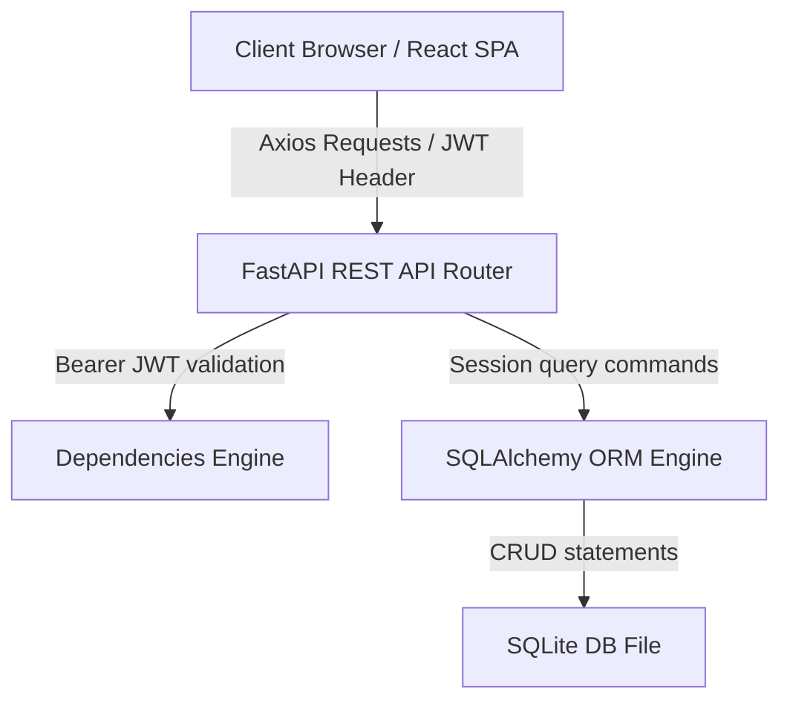

# 🌌 Tekora: High-Performance E-Commerce & User Management Workspace

**Tekora** is a state-of-the-art, single-instance e-commerce platform and User Management System (UMS) styled with an elegant, periwinkle frosted glass theme. This system integrates shopping, seller operations, and administrative oversight into a unified, highly responsive workspace pod.

Designed with a decoupled architecture, **Tekora** combines an asynchronous, high-concurrency **FastAPI (Python)** backend with a fluid, context-driven **React (Vite)** single-page application.

---

## 🌟 Key Features & Role Profiles

Tekora implements role-based access control (RBAC) across three distinct user roles:

*   **🛒 Prime Customers**:
    *   Browse next-generation gadget catalogs with instant, responsive search capabilities.
    *   Manage personal shopping carts and perform checkout flows.
    *   Track active orders with simulated real-time logistics milestones and toast updates.
*   **Verified Sellers**:
    *   Maintain a custom storefront catalog (Add and delete product listings).
    *   Attach and preview high-definition product images via an interactive, drag-and-click upload zone.
    *   Dispatch pending customer orders and track sales revenue statistics.
*   **🛡️ System Administrators**:
    *   Moderate all registered accounts (Activate/Suspend statuses).
    *   Audit detailed purchase logs, user transaction histories, and overall database operations.
    *   Maintain system-wide privileges to manage any product listing or order log.

---

## 🏛️ System Architecture

Tekora is designed around standard software patterns, ensuring separation of concerns (SoC) and stateless authorization:



---

## 💻 Tech Stack Breakdown

### Frontend
*   **Core UI Engine**: React (Vite SPA)
*   **Styling System**: Responsive Vanilla CSS Variables (High-fidelity glassmorphism theme)
*   **State Management**: Context API (Decoupled Auth, Cart, and Toast providers)
*   **Routing**: React Router DOM (Declarative client-side routing & Protected guards)
*   **Icons**: Lucide React

### Backend
*   **API Framework**: FastAPI (High-performance, event-driven async Python ASGI framework)
*   **ASGI Server**: Uvicorn
*   **ORM**: SQLAlchemy
*   **Serialization**: Pydantic v2 (Schema data serialization & validation)
*   **Security & Hashing**: Passlib (Bcrypt password hashing) & PyJWT (jose)

---

## 🚀 Quick Setup & Installation

Follow these steps to spin up the entire application locally:

### Prerequisites
*   Python 3.10+
*   Node.js 18+

---

### 1. Backend Service Setup

Navigate to the project root directory:

1.  **Create a Virtual Environment**:
    ```bash
    python3 -m venv .venv
    source .venv/bin/activate  # On Windows, use `.venv\Scripts\activate`
    ```

2.  **Install Dependencies**:
    ```bash
    pip install -r requirements.txt
    ```

3.  **Configure Environment Variables**:
    Create a `.env` file in the root directory:
    ```ini
    PROJECT_NAME="Tekora API"
    DATABASE_URL="sqlite:///./test.db"
    SECRET_KEY="super-secret-tekora-encryption-key-phrase"
    TOKEN_EXPIRY=60
    ALGORITHM="HS256"
    ```

4.  **Launch the ASGI Server**:
    ```bash
    uvicorn app.main:app --reload
    ```
    *The API will be available at `http://localhost:8000`. The interactive Swagger docs will automatically mount at `http://localhost:8000/docs`.*

---

### 2. Frontend client Setup

Navigate to the `frontend/` subdirectory:

1.  **Install Node Modules**:
    ```bash
    cd frontend
    npm install
    ```

2.  **Start the hot-reloading Dev Server**:
    ```bash
    npm run dev
    ```
    *The client interface will spin up at `http://localhost:5173`.*

---

## 🔒 Default Administrator Credentials

Upon first launching the backend, the database automatically seeds a default system administrator account for testing:
*   **Email**: `admin@test.com`
*   **Password**: `123`

---

## 📝 License
This project is open-source and available under the [MIT License](LICENSE).
